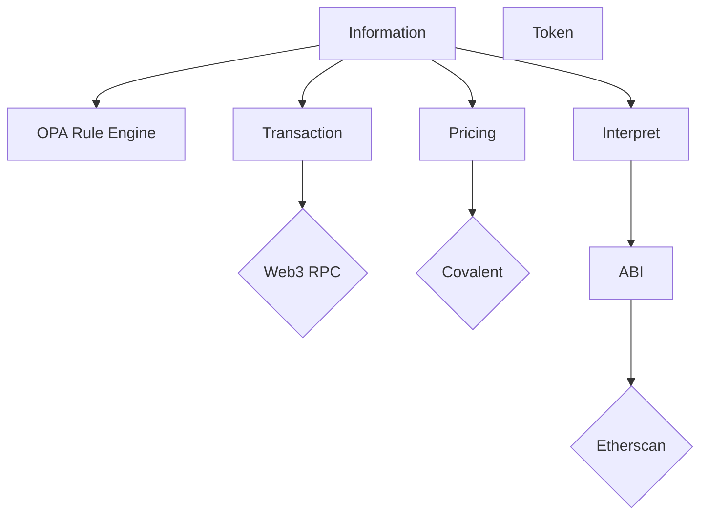

# Blockami
This projects intends to be a general decoder of transactions and standarize outputs via events. Currently works on EVM chains but have plans to support other technologies.

Want to try it out? [Blockami](https://blockami.github.io)

# Why?
I want to have a tool that generates standard events from blockchain transactions (swap, transfer, stake, LP provision....).

# How does it work?
This project is compromised of several microservices used to gather and decode data.

The process at high level is:
- Get raw transaction and logs from RPC node.
- Interpret data of the transaction and logs using the ABI.
- Use the OPA as a rule engine to extract events. You can check [repository](https://github.com/blockami/opa-bundle). Rule definition is a WIP.
- Include information about prices.

Here is a diagram with the relationship between them:

# What are the external dependencies?
- Web3 Endpoint
- Etherscan
  - Contract ABIs
- Covalent
  - Pricing
  - Token Info

# What am I working on now?
- Define the list of possible envents and data structure.
  - Check our Rotki definition of events.
- Remove dependency from etherscan ABI.
  - Create a local database of function call signatures similar to 4bytes.
  - The database of function and logs signatures will be based on the last XThousand blocks.
  - This would allow blockami to interpret events on unverified contracts.
- Consider second rules of second order (rules based on events generated in the first step).
- Local DB that allows to scan the whole history of an address and generate some report.
  - Will consider using Rotki if its flexible enough.

# Known limitations
- Contract without code verification will not generate any events.
- Currently only ETH works, other chains will be added later on. All EVM chains should be supported.

# Things this project does not want to become
- Tax filling software.